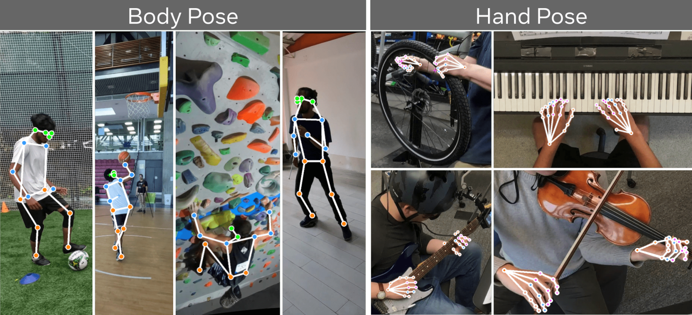
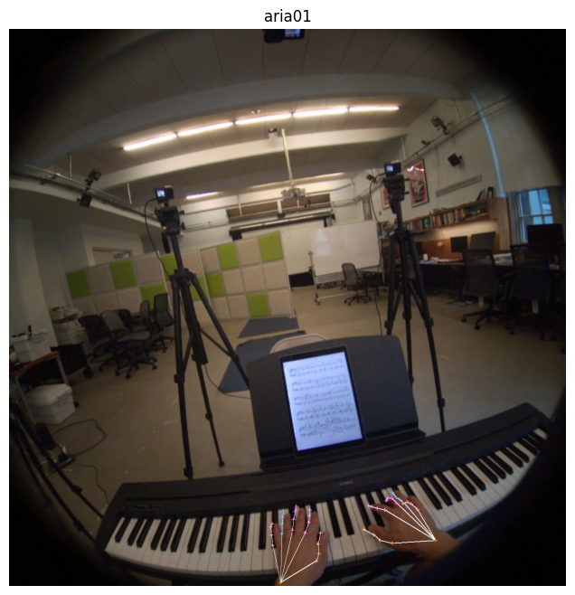

# Tutorial 2: Hand and Body Pose in Ego-Exo4D Dataset


**Filled notebook:**
[](https://github.com/facebookresearch/Ego4d/tree/main/notebooks/egoexo)   
**Author:** Xizi Wang

3D hand and body pose are two important annotations of the Ego-Exo4D dataset. The **first-person (ego)** perspective (right) captures the details of close-by **hand-object** interactions and the camera wearer’s attention, whereas the **third-person (exo)** perspective (left) captures the **full body pose** and surrounding environment context. In this tutorial, we provide a step-by-step guide on retrieving the hand and body pose of one example take, and projecting the body pose to exocentric views and the hand pose to egocentric views, then visualizing it on the corresponding frame.

<center></center>

### 1. Prerequisites and Imports


```python
%matplotlib inline
import cv2
import matplotlib.pyplot as plt
import numpy as np
import math
from matplotlib import rcParams
from projectaria_tools.core import mps
from projectaria_tools.core import data_provider
from projectaria_tools.core import calibration
from projectaria_tools.core.calibration import CameraCalibration, KANNALA_BRANDT_K3
from projectaria_tools.core.stream_id import StreamId

rcParams["figure.figsize"] = 16, 32

import json
import os
import random

import av
import pandas as pd
from PIL import Image, ImageDraw
from tqdm.auto import tqdm

# functions for loading the hand & body pose:
from pose_utilities import get_body_metadata, get_hands_metadata, get_coords
# functions for loading camera calibrations
from pose_utilities import load_csv_to_df
# functions for visualization
from pose_utilities import palette,  draw_skeleton, draw_cross, draw_circle, draw_skeleton_hands, draw_circle_hands, draw_cross_hands, show_results, get_viz, get_frame
```

### 2. Load one sample take and its ego / exo camera's camera calibration.

First, let's define the Ego-Exo4D dataset and its annotation location.


```python
release_dir = "/datasets01/egoexo4d/v2/" # replace this with your download folder
annotation_dir = os.path.join(release_dir, "annotations/")  # annotation folder

# load necessary annotation files
egoexo = {
    "takes": os.path.join(release_dir, "takes.json"),
    "captures": os.path.join(release_dir, "captures.json")
}

for k, v in egoexo.items():
    egoexo[k] = json.load(open(v))

takes = egoexo["takes"]
captures = egoexo["captures"]
takes_by_uid = {x["take_uid"]: x for x in takes}
```

We then randomly sample one example take of playing piano. We also provide the take uid of some other takes as examples.


```python
#take_uid = "0bc47e29-e086-4726-b874-f89671366f06"  # Violin
take_uid = "23ff1c48-01ea-4d34-a38b-bc96e767b9b9" #Piano
#take_uid = "02715c86-e30c-4791-92b7-38b488e51aba"  # Bike

take = [take for take in egoexo["takes"] if take["take_uid"] == take_uid]
take = take[0]
```

And load the camera intrinsics and extrinsics of the take. **exo_traj_df** reads in the exocentric cameras calibrations in csv format.


```python
# Initialize exo cameras from calibration file
traj_dir = os.path.join(release_dir, take["root_dir"], "trajectory")
exo_traj_path = os.path.join(traj_dir, "gopro_calibs.csv")

exo_traj_df = load_csv_to_df(exo_traj_path)
exo_cam_names = list(exo_traj_df["cam_uid"])
ego_cam_names = [x["cam_id"] for x in take["capture"]["cameras"] if x["is_ego"] and x["cam_id"].startswith("aria")]
all_cams = ego_cam_names + exo_cam_names
ego_cam_name = ego_cam_names[0]
print("exo cameras:\t", exo_cam_names)
print("ego camera:\t", ego_cam_name)
```

    exo cameras:	 ['gp01', 'gp02', 'gp03', 'gp04', 'gp05']
    ego camera:	 aria01


#### 2.1 load exocentric camera calibrations

The exocentric camera calibrations can be read using Project Aria Machine Perception Services (MPS). We store them with camera uid as keys in **go_pro_proxy**.


```python
go_pro_proxy = {}
static_calibrations = mps.read_static_camera_calibrations(exo_traj_path)
for static_calibration in static_calibrations:
    # assert the GoPro was correctly localized
    if static_calibration.quality != 1.0:
        print(f"Camera: {static_calibration.camera_uid} was not localized, ignoring this camera.")
        continue
    proxy = {}
    proxy["name"] = static_calibration.camera_uid
    proxy["pose"] = static_calibration.transform_world_cam
    proxy["camera"] = CameraCalibration(
                            static_calibration.camera_uid,
                            KANNALA_BRANDT_K3,
                            static_calibration.intrinsics,
                            static_calibration.transform_world_cam, # probably extrinsics
                            static_calibration.width,
                            static_calibration.height,
                            None,
                            math.pi,
                            "")

    go_pro_proxy[static_calibration.camera_uid] = proxy
```

    Camera: gp05 was not localized, ignoring this camera.
    Loaded #StaticCameraCalibration data: 5


#### 2.2 load egocentric camera calibrations

We read the egocentric camera intrinsics using VRS and camera extrinsics using MPS.


```python
## Configure the VRSDataProvider (interface used to retrieve Trajectory data)
ego_exo_project_path = os.path.join(release_dir, 'takes', take['take_name'])

aria_dir = os.path.join(release_dir, take["root_dir"])
aria_path = os.path.join(aria_dir, f"{ego_cam_name}.vrs")
vrs_data_provider = data_provider.create_vrs_data_provider(aria_path)
device_calibration = vrs_data_provider.get_device_calibration()

rgb_stream_id = StreamId("214-1")
rgb_stream_label = vrs_data_provider.get_label_from_stream_id(rgb_stream_id)
rgb_camera_calibration = device_calibration.get_camera_calib(rgb_stream_label)

mps_data_paths_provider = mps.MpsDataPathsProvider(ego_exo_project_path)
mps_data_paths = mps_data_paths_provider.get_data_paths()
mps_data_provider = mps.MpsDataProvider(mps_data_paths)
```

    [ProgressLogger][INFO]: 2025-01-08 01:22:38: Opening /datasets01/egoexo4d/v2/takes/upenn_0721_Piano_2_5/aria01.vrs...
    [MultiRecordFileReader][DEBUG]: Opened file '/datasets01/egoexo4d/v2/takes/upenn_0721_Piano_2_5/aria01.vrs' and assigned to reader #0
    [VrsDataProvider][INFO]: streamId 211-1/camera-et activated
    [VrsDataProvider][INFO]: streamId 214-1/camera-rgb activated
    [VrsDataProvider][INFO]: streamId 231-1/mic activated
    [VrsDataProvider][INFO]: streamId 247-1/baro0 activated
    [VrsDataProvider][WARNING]: Unsupported TimeSync mode: APP, ignoring.
    [VrsDataProvider][INFO]: Fail to activate streamId 286-1
    [VrsDataProvider][INFO]: streamId 1201-1/camera-slam-left activated
    [VrsDataProvider][INFO]: streamId 1201-2/camera-slam-right activated
    [VrsDataProvider][INFO]: streamId 1202-1/imu-right activated
    [VrsDataProvider][INF

    O]: streamId 1202-2/imu-left activated
    [VrsDataProvider][INFO]: streamId 1203-1/mag0 activated
    [MpsDataPathsProvider][WARNING]: Hand tracking folder (/datasets01/egoexo4d/v2/takes/upenn_0721_Piano_2_5/hand_tracking) does not exist in MPS root folder, not loading wrist and palm poses.
    

### 3. Load body / hand pose and project it to exocentric views

In this section, we go through the steps of projecting body / hand pose to exocentric views. We first load the annotation file of the pose. The annotation is a dictionary with the frame indices as keys. As an example, we randomly sample the 3D and 2D annotation of one frame. You can switch annotation_type to choose between body and hand.


```python
annotation_type = "hand" # annotation_type should be body or hand.

# get body pose annotation folder
egopose_ann_dir = os.path.join(
    annotation_dir, f"ego_pose/train/{annotation_type}/annotation"
)
# get the annotation file of the sampled take
annotation_file_path = os.path.join(egopose_ann_dir, f"{take_uid}.json")
all_annotations = json.load(open(annotation_file_path))
# annotation is a dictionary with frame numbers as keys, we then randomly sample one frame.
frame_idx = random.sample(list(all_annotations.keys()), 1)[0]
annotation = all_annotations[frame_idx][0]
frame_idx = int(frame_idx)
print(f"annotation at sampled frame {frame_idx} is {annotation.keys()}.")
```

    annotation at sampled frame 3382 is dict_keys(['annotation3D', 'annotation2D']).


Next we read the corresponding at the sampled frame index from exocentric videos and egocentric video. We store it in a dictionary **videos** with camera name as key.


```python
base_directory = os.path.join(release_dir, take["root_dir"])
videos = {}
for cam_name in all_cams:
    if cam_name in exo_cam_names:
        stream_name = '0'
    else:
        stream_name = 'rgb'
        
    local_path = os.path.join(base_directory, take['frame_aligned_videos'][cam_name][stream_name]['relative_path'])
    container = av.open(local_path) 
    videos[cam_name] = get_frame(local_path, frame_idx)    
```

We retrieve the pose in the format of 3D keypoints from the annotation file. 3D keypoints are world coordinates of the pose. Note that annotation also have **annotation2D** which are 2D keypoints annotated on undistorted frames. We will show this part later in projecting hand pose to egocentric frame.


```python
parts = list(annotation["annotation3D"].keys())
annot_3d = {}
for part in parts:
    keypoint = annotation["annotation3D"][part]
    annot_3d[part] = [keypoint['x'], keypoint['y'], keypoint['z']]
```

With exocentric camera calibration, we project the 3D body/hand keypoints to different exocentric views. The process is similar to the reprojection in the gaze tutorial. The body/hand keypoint is first projected from world coordinates to exocentric camera device, then to the exocentric camera image plane.


```python
per_go_pro_reprojection = {}
for go_pro in go_pro_proxy:
    if go_pro not in per_go_pro_reprojection.keys():
        per_go_pro_reprojection[go_pro] = {}
    for part in parts:
        pose_vector_in_world = annot_3d[part]
        # project the keypoint from world to go_pro device
        pose_in_go_pro_world = go_pro_proxy[go_pro]["pose"].inverse() @ pose_vector_in_world

        # project the keypoint from go_pro device to go_pro image plane
        device_projection = go_pro_proxy[go_pro]["camera"].project(pose_in_go_pro_world)
        if device_projection is None:
            continue
        else:
            per_go_pro_reprojection[go_pro][part] = {'x': device_projection[0], 'y': device_projection[1], 'placement': 'manual'}     
```

We define the keypoints_map, skeleton and pose_kpt_color for visualization.


```python
if annotation_type == "body":
    keypoints_map, skeleton, pose_kpt_color = get_body_metadata()
else:
    keypoints_map, skeleton, pose_kpt_color = get_hands_metadata()
```


```python
projection_results = {}
for cam_name in per_go_pro_reprojection.keys():
    viz_img = get_viz(
        videos[cam_name],
        keypoints_map,
        per_go_pro_reprojection[cam_name],
        skeleton,
        pose_kpt_color,
        annot_type=annotation_type,
    )
    projection_results[cam_name] = viz_img
show_results(projection_results)
```


    

    


    

    


    

    


    

    


### 3. Projecting pose to egocentric view using camera info

In this section, we further provide instructions projecting hand pose to egocentric view, since hand-object interaction is an important part of egocentric video analysis. The projection includes the following steps:
1. retrieve 3D pose of the hand keypoint as world coordinates from annotation
2. retrieve camera intrinsics and extrinsics from camera_info
3. project the 3D keypoint from world to aria device with camera extrinsics
4. project the 3D keypoint from aria device to aria image plane with camera intrinsics
5. get the resulted 2D keypoint


```python
takes_info = json.load(open(os.path.join(release_dir, "takes.json")))

# go through all takes to locate the sampled take, i.e., cmu_bike01_5
take_name = take["take_name"]
import re

# get the capture name, and load the timesync.csv
capture_name = re.sub(r"_\d+$", "", take_name)
timesync = pd.read_csv(os.path.join(release_dir, f"captures/{capture_name}/timesync.csv"))

start_idx = take["timesync_start_idx"]+1
end_idx = take["timesync_end_idx"]
take_timestamps = []
for idx in range(start_idx, end_idx):
    take_timestamps.append(int(timesync.iloc[idx][f"aria01_214-1_capture_timestamp_ns"]))
sample_timestamp = take_timestamps[int(frame_idx)]
```


```python
ego_reprojection = {}
pose_info = mps_data_provider.get_closed_loop_pose(sample_timestamp)

cam = ego_cam_name
for part in parts:
    pose_vector_in_world = annot_3d[part]

    if pose_info:
        # transform coordinates from device to world
        T_world_device = pose_info.transform_world_device
        
    T_device_camera = rgb_camera_calibration.get_transform_device_camera()
    T_world_camera = T_world_device @ T_device_camera

    pose_in_aria_world = T_world_camera.inverse() @ pose_vector_in_world
    device_projection = rgb_camera_calibration.project(pose_in_aria_world)

    if device_projection is None:
        continue
    else:
        x_coord = device_projection[0]
        y_coord = device_projection[1]
        ego_reprojection[part] = {'x': x_coord, 'y': y_coord, 'placement': 'auto'}   
```

    Loaded #closed loop trajectory poses records: 646865


Now let's visualize the projected hand pose on the aria frame.


```python
ego_local_path = os.path.join(base_directory, take['frame_aligned_videos'][ego_cam_name]['rgb']['relative_path'])  
ego_frame = get_frame(ego_local_path, frame_idx) 
if annotation_type == 'hand':
    cam_name = ego_cam_name
    ann = ego_reprojection
    img = ego_frame
    img = img.rotate(90)
    image_array = np.asarray(img)
    image = Image.fromarray(image_array, "RGB")

    viz_img = get_viz(image, keypoints_map, ann, skeleton, pose_kpt_color, annot_type=annotation_type, is_aria=True)
    plt.figure(figsize=(8, 8))
    plt.imshow(viz_img.rotate(270))
    plt.axis("off")  # Hide the axes ticks
    plt.title(f"{cam_name}")
    plt.show()
```


    

    


### Conclusion

In this notebook, we reviewed loading takes, its egocentric and exocentric camera calibrations and EgoPose annotations. We also provided a step-by-step guide on projecting 3D hand/body keypoints to different views with the camera calibrations. This can serve as a good starting point to understand EgoPose and utilize it for research in the future.

---

[](https://github.com/facebookresearch/Ego4d)  If you found this tutorial helpful, consider ⭐-ing our repository.    
[](https://github.com/facebookresearch/Ego4d/issues)  For any questions, typos, or bugs that you found, please raise an issue on GitHub. 

---
